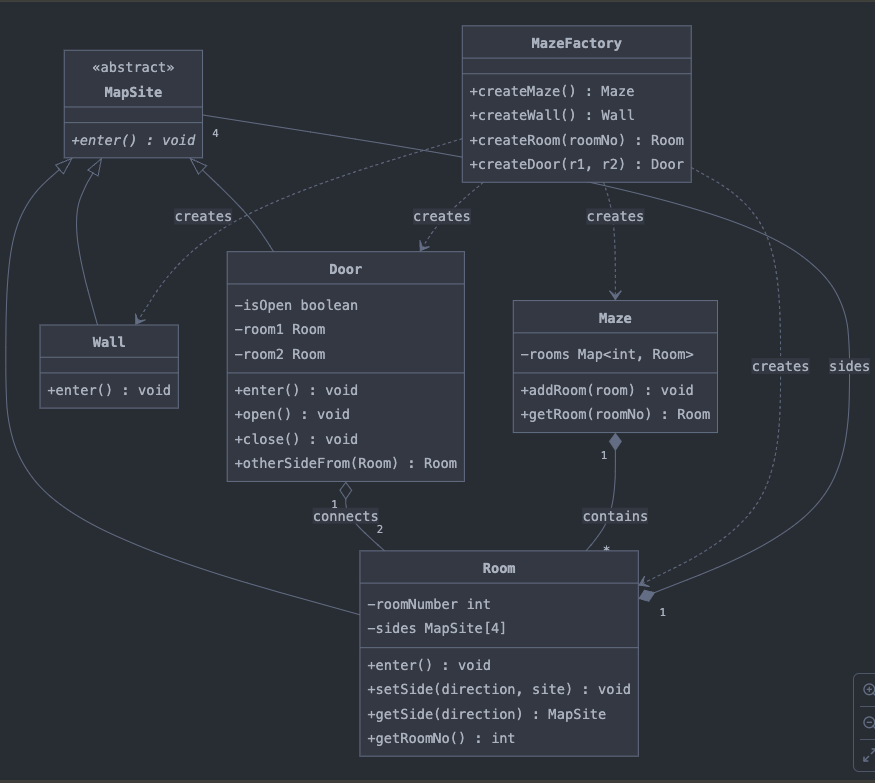

# Maze Creation Using Design Patterns

This document explains the implementation of a maze creation system using object-oriented principles and design patterns. The implementation is based on the UML diagram provided and incorporates the Factory Method design pattern to create and manage the components of the maze.

## Design Pattern: Factory Method

### Why We Used It
The Factory Method design pattern is used to define an interface for creating objects in a superclass, allowing subclasses to alter the type of objects that will be created. In our implementation, the `MazeFactory` class provides a way to encapsulate the creation logic for the maze and its components (rooms, doors, walls). This approach ensures modularity and scalability, making it easy to modify or extend the maze's structure in the future.

### How It Works
1. **Abstract Factory Interface:**
   The `MazeFactory` class defines methods for creating maze components such as rooms, doors, and walls.

2. **Encapsulation of Creation Logic:**
   The `MazeFactory` creates objects like `Room`, `Door`, and `Wall`, isolating the construction logic from the main program.

3. **Dynamic Component Creation:**
   By leveraging the `MazeFactory`, we can dynamically create a maze with any number of rooms, connecting them with doors and enclosing them with walls. This flexibility adheres to the principles of reusable and maintainable code.

---

## Implementation Overview

### Classes and Responsibilities

1. **`MapSite`** (Abstract Base Class):
    - Represents a generic component of the maze.
    - Provides an abstract method `enter()` that is implemented by its subclasses.

2. **`Room`**:
    - Represents a single room in the maze.
    - Stores the room number and its sides (north, south, east, west).
    - Methods: `enter()`, `setSide()`, `getSide()`, `getRoomNo()`.

3. **`Door`**:
    - Represents a door connecting two rooms.
    - Stores references to the two rooms it connects and its state (open/closed).
    - Methods: `enter()`, `open()`, `close()`.

4. **`Wall`**:
    - Represents a wall enclosing a room.
    - Implements the `enter()` method to notify the user they hit a wall.

5. **`Maze`**:
    - Manages the collection of rooms in the maze.
    - Methods: `addRoom()`, `getRoom()`.

6. **`MazeFactory`**:
    - Encapsulates the creation of maze components.
    - Methods: `createMaze()`, `createRoom()`, `createDoor()`, `createWall()`.

---

## How the System Works

### Dynamic Maze Creation
1. The main function calls `createMazeWithRooms(n)` to dynamically generate a maze with `n` rooms.
2. A loop creates `Room` objects, adding them to the maze and storing references for later connections.
3. Each room is assigned walls on its `north` and `south` sides.
4. `Door` objects connect adjacent rooms on the `west` and `east` sides.
5. The `MazeFactory` ensures the modular creation of these components.

### Maze Testing
The `testMaze` function iterates through each room in the maze:
- Enters the room and logs its number.
- Tries to move east and west, testing the doors' states (open/close) and interaction logic.
- Logs interactions with walls and doors to verify the maze's correctness.

---

## UML Diagram
Below is the UML representation of the system, capturing the relationships between classes:

